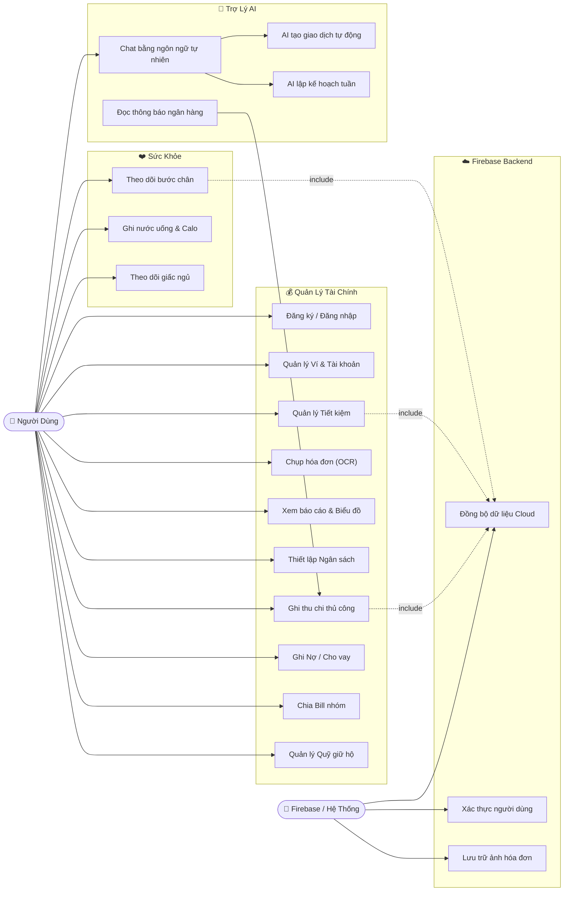
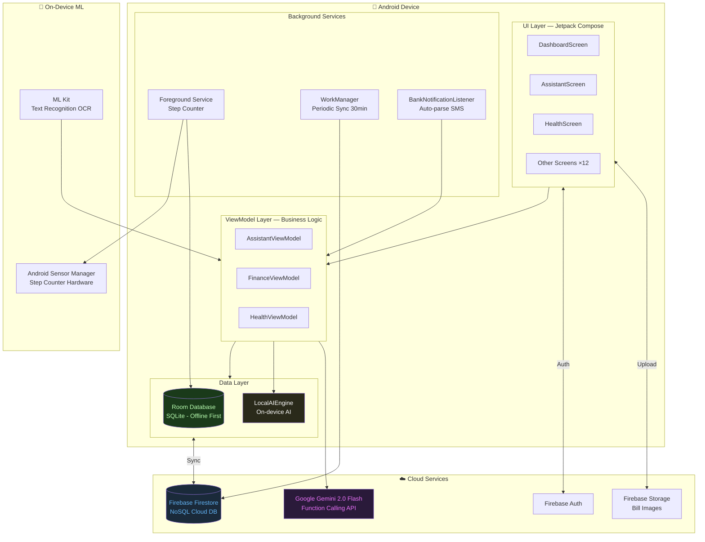
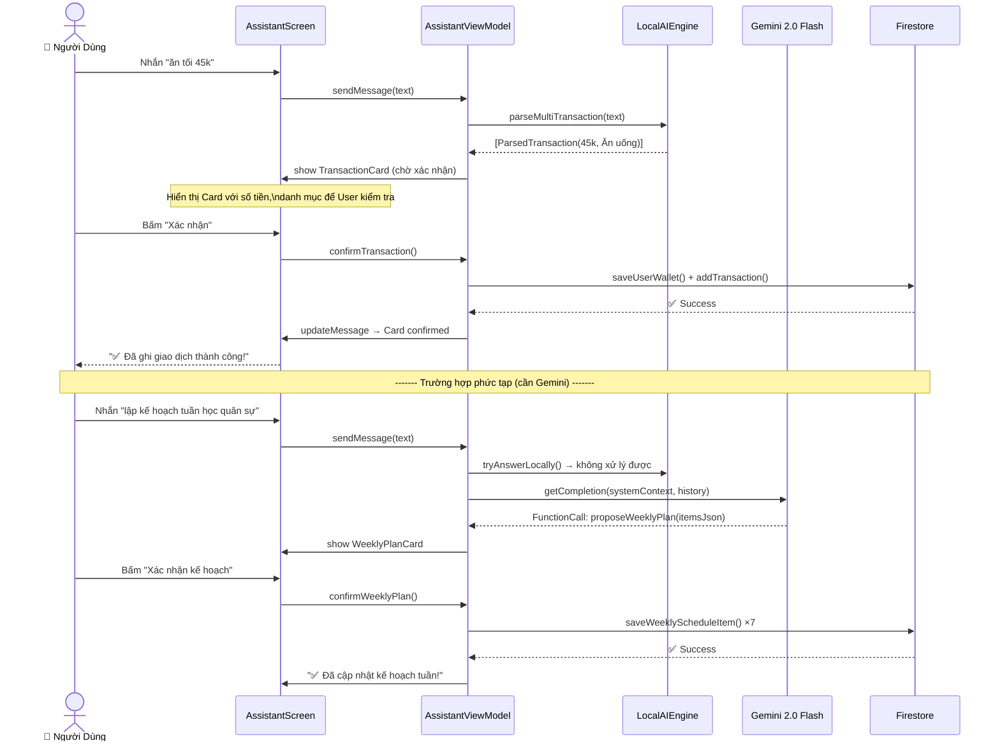
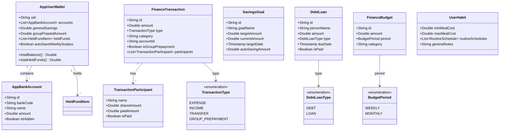
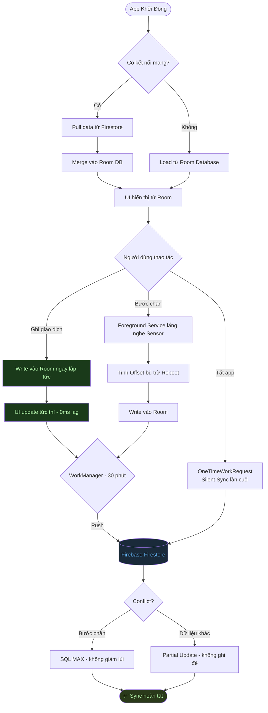
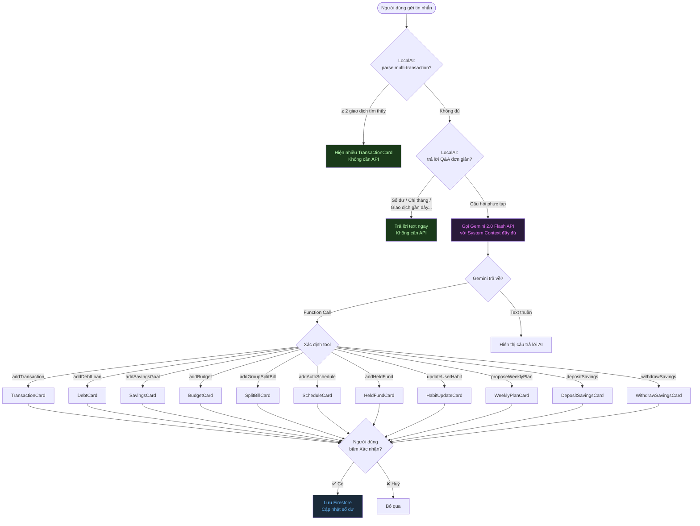

# 📊 Biểu Đồ Mermaid — Báo Cáo FinFit

> **Cách dùng:** Copy từng code block → Dán vào https://mermaid.live → Export PNG/SVG

---

## Biểu Đồ 1: Use Case Tổng Quan (dùng flowchart)

> ⚠️ Mermaid không có `usecaseDiagram`. Dùng `flowchart` để mô phỏng — kết quả tương đương.



---

## Biểu Đồ 2: Kiến Trúc Hệ Thống (System Architecture)



---

## Biểu Đồ 3: Sequence Diagram — Luồng AI Assistant



---

## Biểu Đồ 4: Class Diagram — Data Models Chính



---

## Biểu Đồ 5: Flowchart — Luồng Offline-First & Cloud Sync



---

## Biểu Đồ 6: Flowchart — Hybrid AI Decision Tree



---

## 📋 Hướng Dẫn Export

1. Vào **https://mermaid.live**
2. Copy từng code block ở trên (phần trong dấu ` ```mermaid ... ``` `)
3. Dán vào ô Editor bên trái
4. Bấm **"Download SVG"** hoặc **"Download PNG"** ở góc phải

> **Tip:** SVG dùng cho Word/PowerPoint sẽ sắc nét hơn PNG khi zoom.
