# 📊 Biểu đồ Lớp UML Module Health (PlantUML)

Bạn có thể copy đoạn code dưới đây và dán vào [PlantText](https://www.planttext.com/) hoặc [PlantUML Online Server](https://www.plantuml.com/plantuml) để vẽ ra sơ đồ lớp (Class Diagram) trực quan.

```plantuml
@startuml
skinparam backgroundColor #0e0e0e
skinparam handwritten false
skinparam class {
    BackgroundColor #1a1a1a
    ArrowColor #64b5f6
    BorderColor #adaaaa
    FontColor #white
    FontSize 12
    AttributeFontColor #ffcc80
    MethodFontColor #bbffb3
}
skinparam stereotypePosition top
skinparam package {
    BackgroundColor #0c1a24
    BorderColor #64b5f6
    FontColor #white
}

package "com.example.finfit.health.model" {
    class HealthUiState {
        +steps: Int
        +stepGoal: Int
        +caloriesOut: Int
        +caloriesIn: Int
        +calorieGoal: Int
        +waterConsumedMl: Int
        +waterGoalMl: Int
        +sleepHours: Float
        +netCalorieBalance: Int
        +nutritionScore: Int
        +waterScore: Int
        +sleepScore: Int
        +activityScore: Int
        +totalHealthScore: Int
    }
    
    class WaterScreenData {
        +totalConsumedMl: Int
        +effectiveHydrationMl: Int
        +caffeineMg: Int
        +drinkLogs: List<WaterLogUiItem>
    }
    
    class SleepLogUiItem {
        +id: Long
        +bedTimeTimestamp: Long
        +wakeTimeTimestamp: Long
        +quality: Int
    }
}

package "com.example.finfit.health.repository" {
    class HealthDatabase {
        +stepDao(): StepDao
        +waterLogDao(): WaterLogDao
        +waterSummaryDao(): WaterSummaryDao
        +sleepLogDao(): SleepLogDao
    }
    
    interface StepDao {
        +insertStep(step: StepEntity)
        +getStepsByDate(date: String): Flow<StepEntity?>
    }
    
    interface WaterLogDao {
        +insertLog(log: WaterLogEntity)
        +deleteLog(id: Long)
        +getLogsByDate(date: String): Flow<List<WaterLogEntity>>
        +sumEffectiveHydrationMlByDate(date: String): Flow<Int?>
        +sumCaffeineMgByDate(date: String): Flow<Int?>
    }
    
    interface SleepLogDao {
        +insertSleep(sleep: SleepLogEntity)
        +deleteSleep(id: Long)
        +getSleepByDate(date: String): Flow<List<SleepLogEntity>>
    }

    class HealthRepository {
        -stepDao: StepDao
        +getStepsForDate(date: String): Flow<StepEntity?>
        +saveSteps(steps: Int, date: String)
    }

    class WaterRepository {
        -waterLogDao: WaterLogDao
        -waterSummaryDao: WaterSummaryDao
        +logWater(amountMl: Int, drinkType: String, caffeineMg: Int, effectiveMl: Int)
        +deleteWaterLog(id: Long, date: String)
    }

    class SleepRepository {
        -sleepLogDao: SleepLogDao
        +logSleep(bedTime: Long, wakeTime: Long)
        +deleteSleep(id: Long)
    }

    class VisionAiRepository {
        -geminiClient: GeminiClient
        +analyzeFoodImage(imageUri: Uri): Flow<FoodAnalysisResult>
    }
}

package "com.example.finfit.health.repository.viewmodel" {
    class HealthViewModel {
        -healthRepository: HealthRepository
        -waterRepository: WaterRepository
        +healthUiState: StateFlow<HealthUiState>
        +logWater(amountMl: Int, goalMl: Int)
    }

    class FoodCameraViewModel {
        -visionAiRepository: VisionAiRepository
        -mealRepository: MealRepository
        +analysisState: StateFlow<AnalysisUiState>
        +scanFoodImage(imageUri: Uri)
    }
}

package "com.example.finfit.health.manager" {
    class StepCounterService {
        -sensorManager: SensorManager
        -stepCounterManager: StepCounterManager
        +onSensorChanged(event: SensorEvent)
    }

    class StepCounterManager {
        -healthRepository: HealthRepository
        +updateStepCount(steps: Int)
    }
}

package "com.example.finfit.health.ui" {
    class HealthDashboardScreen <<Composable>>
    class WaterTrackerScreen <<Composable>>
    class SleepScheduleScreen <<Composable>>
    class StepCounterScreen <<Composable>>
    class FoodScannerScreen <<Composable>>
}

' Relationships
HealthDatabase --> StepDao
HealthDatabase --> WaterLogDao
HealthDatabase --> SleepLogDao

HealthRepository --> StepDao
WaterRepository --> WaterLogDao
SleepRepository --> SleepLogDao

HealthViewModel --> HealthRepository
HealthViewModel --> WaterRepository
HealthViewModel --> SleepRepository
HealthViewModel --> HealthUiState

FoodCameraViewModel --> VisionAiRepository

StepCounterService --> StepCounterManager
StepCounterManager --> HealthRepository

HealthDashboardScreen --> HealthViewModel
WaterTrackerScreen --> WaterRepository
SleepScheduleScreen --> SleepRepository
FoodScannerScreen --> FoodCameraViewModel

@endum
```

