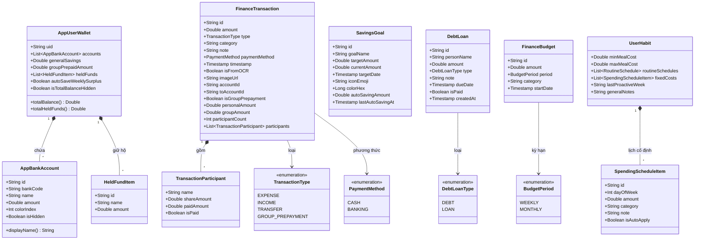
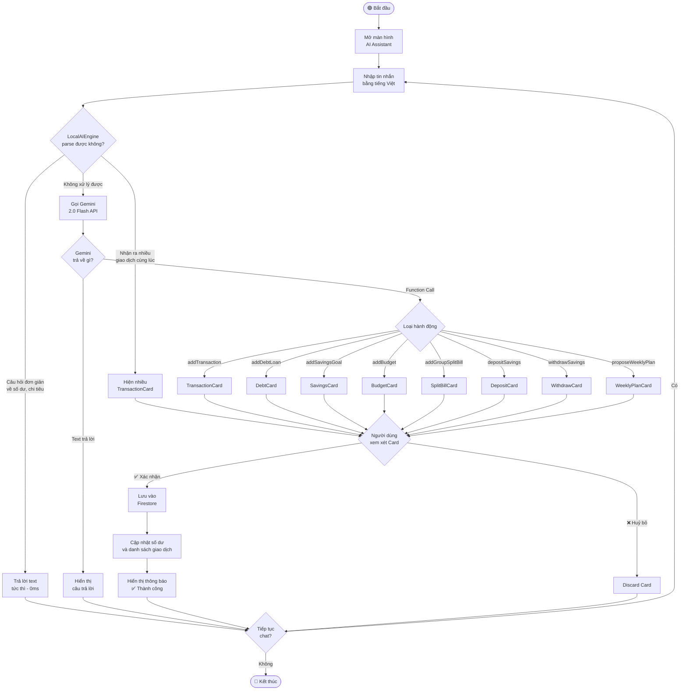
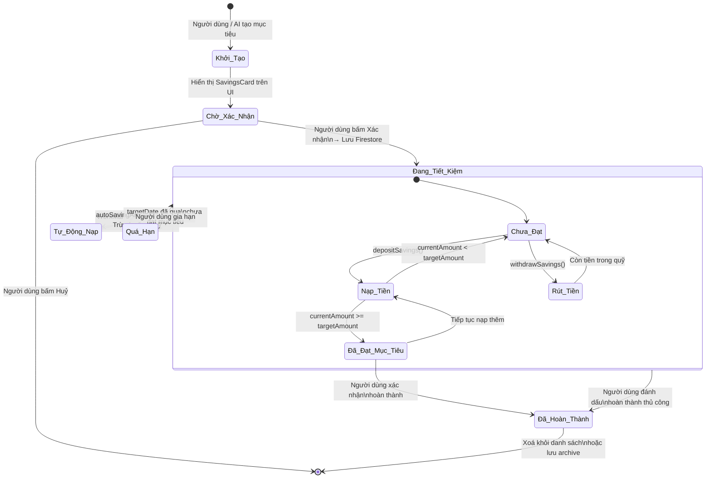
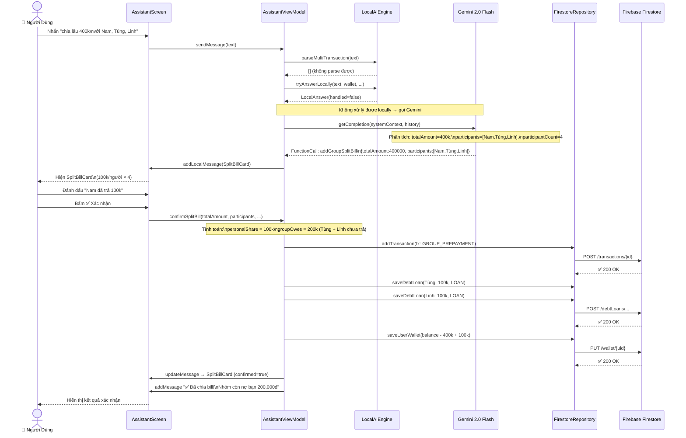
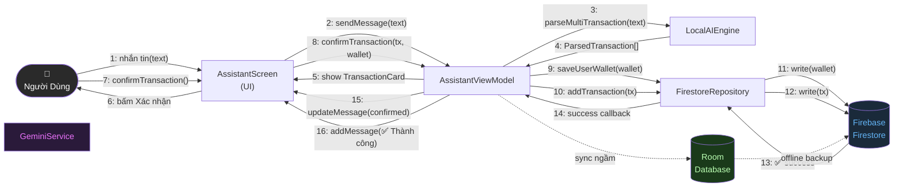

# 🗂️ 5 Biểu Đồ UML — Dự Án FinFit
> Paste từng code block vào **https://mermaid.live** → Export PNG/SVG ngay

---

## 1. Biểu Đồ Lớp — Class Diagram

---

## 2. Biểu Đồ Hoạt Động — Activity Diagram

> **Kịch bản:** Luồng người dùng ghi giao dịch qua AI Assistant

---

## 3. Biểu Đồ Trạng Thái — State Diagram

> **Kịch bản:** Vòng đời của một Mục Tiêu Tiết Kiệm (SavingsGoal)

---

## 4. Biểu Đồ Trình Tự — Sequence Diagram

> **Kịch bản:** Chia bill nhóm (Split Bill) qua AI

---

## 5. Biểu Đồ Giao Tiếp — Communication Diagram

> ⚠️ Mermaid không có `communicationDiagram`. Dùng `flowchart` với đánh số thứ tự thông điệp — chuẩn UML.
>
> **Kịch bản:** Các đối tượng giao tiếp khi xử lý giao dịch thu chi

---

## 📋 Tóm Tắt & Hướng Dẫn

| # | Biểu đồ | Cú pháp Mermaid | Mô tả kịch bản |
|---|---------|-----------------|----------------|
| 1 | **Class Diagram** | `classDiagram` | Toàn bộ data model tài chính |
| 2 | **Activity Diagram** | `flowchart TD` | Luồng ghi giao dịch qua AI |
| 3 | **State Diagram** | `stateDiagram-v2` | Vòng đời Mục Tiêu Tiết Kiệm |
| 4 | **Sequence Diagram** | `sequenceDiagram` | Chia bill nhóm qua AI |
| 5 | **Communication Diagram** | `flowchart LR` | Giao tiếp giữa các đối tượng |

### Các bước export:
1. Vào **https://mermaid.live**
2. **Xoá hết** code cũ trong ô trái
3. **Paste** code block mong muốn vào
4. Biểu đồ tự render bên phải
5. Nhấn nút **"PNG"** hoặc **"SVG"** phía trên preview để tải về
