# 📐 Biểu Đồ UML Chi Tiết Theo Use Case — FinFit
> Mỗi Use Case có đủ: Activity · Sequence · State · Communication
> Paste vào https://mermaid.live để render

---
# UC01: Đăng Ký / Đăng Nhập

## UC01 — Activity Diagram
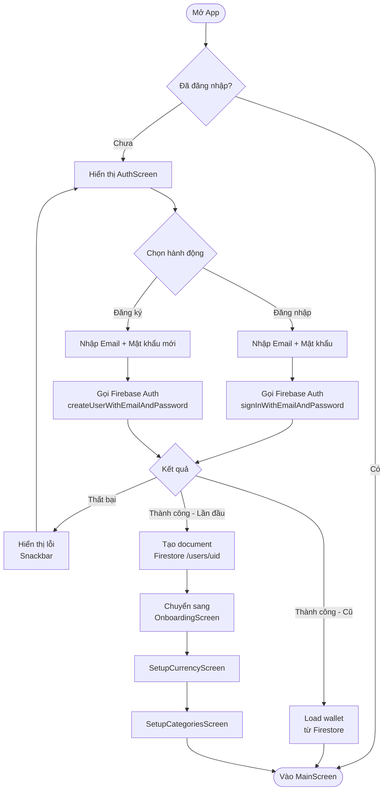

## UC01 — Sequence Diagram
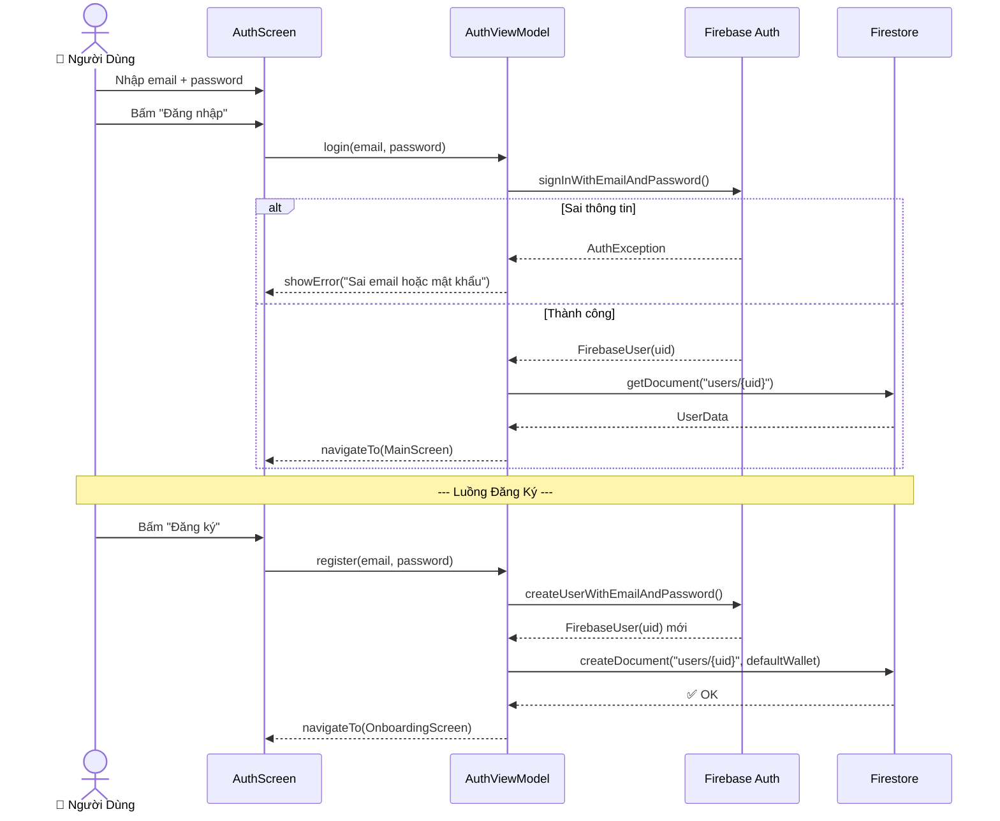

## UC01 — State Diagram
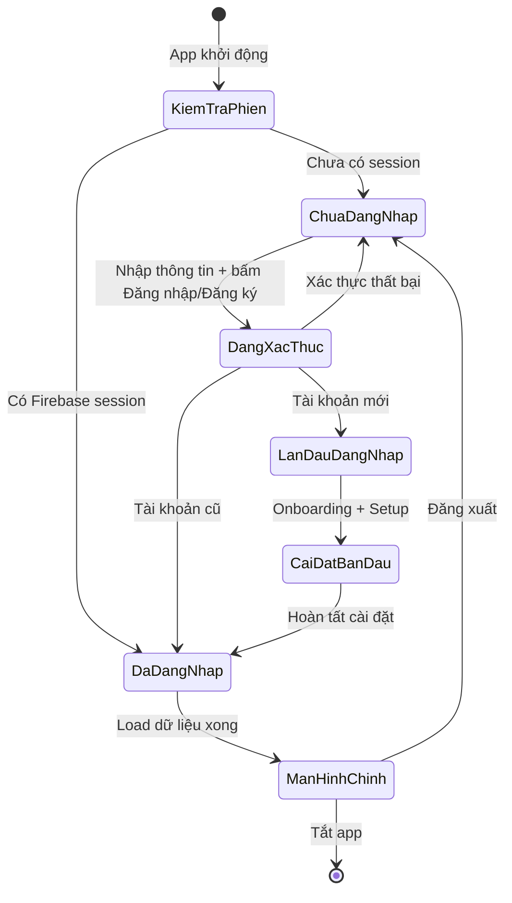

## UC01 — Communication Diagram
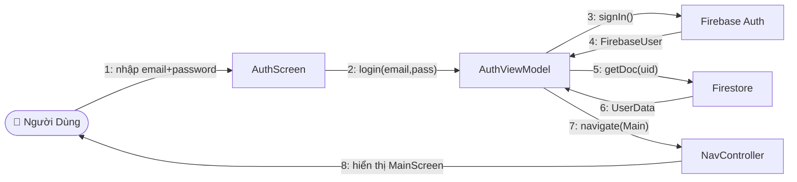

---
# UC02: Ghi Giao Dịch Qua AI

## UC02 — Activity Diagram
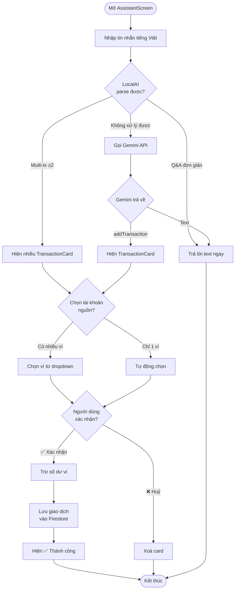

## UC02 — Sequence Diagram
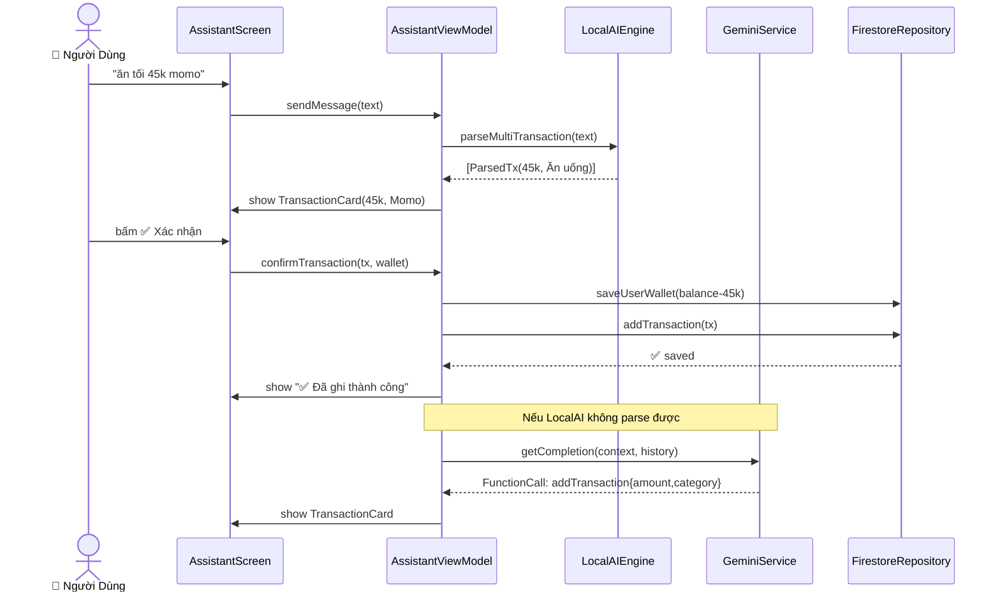

## UC02 — State Diagram
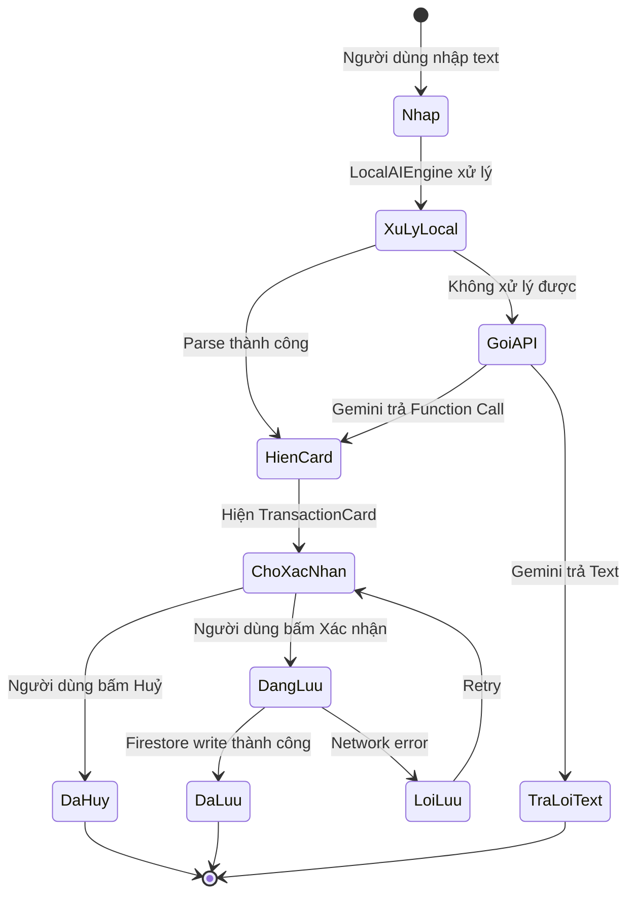

## UC02 — Communication Diagram
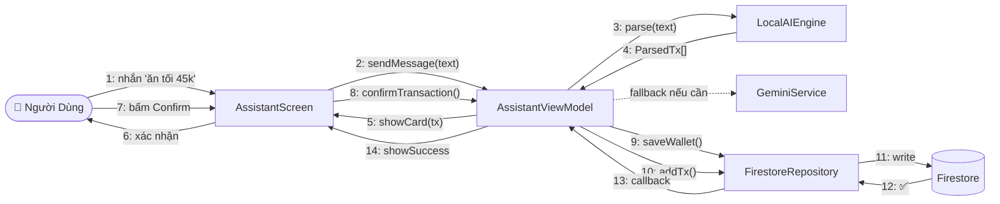

---
# UC03: Chia Bill Nhóm (Split Bill)

## UC03 — Activity Diagram
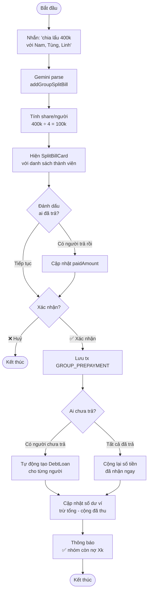

## UC03 — Sequence Diagram
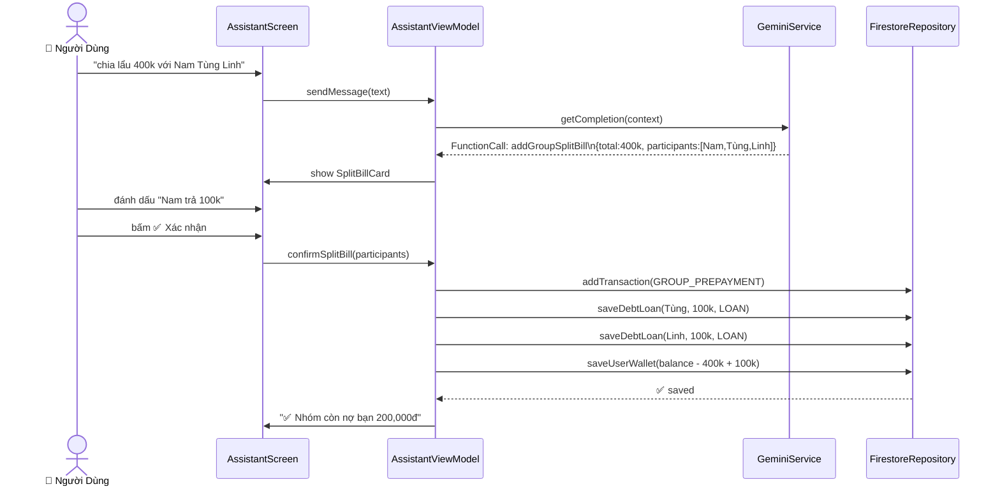

## UC03 — State Diagram
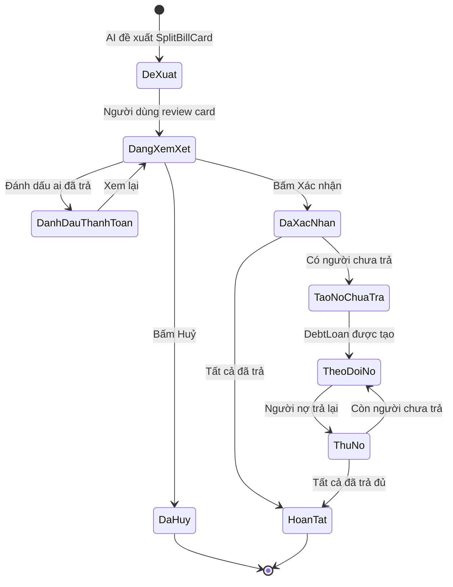

## UC03 — Communication Diagram
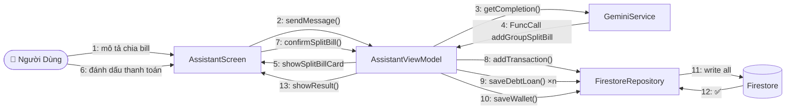

---
# UC04: Quản Lý Mục Tiêu Tiết Kiệm

## UC04 — Activity Diagram
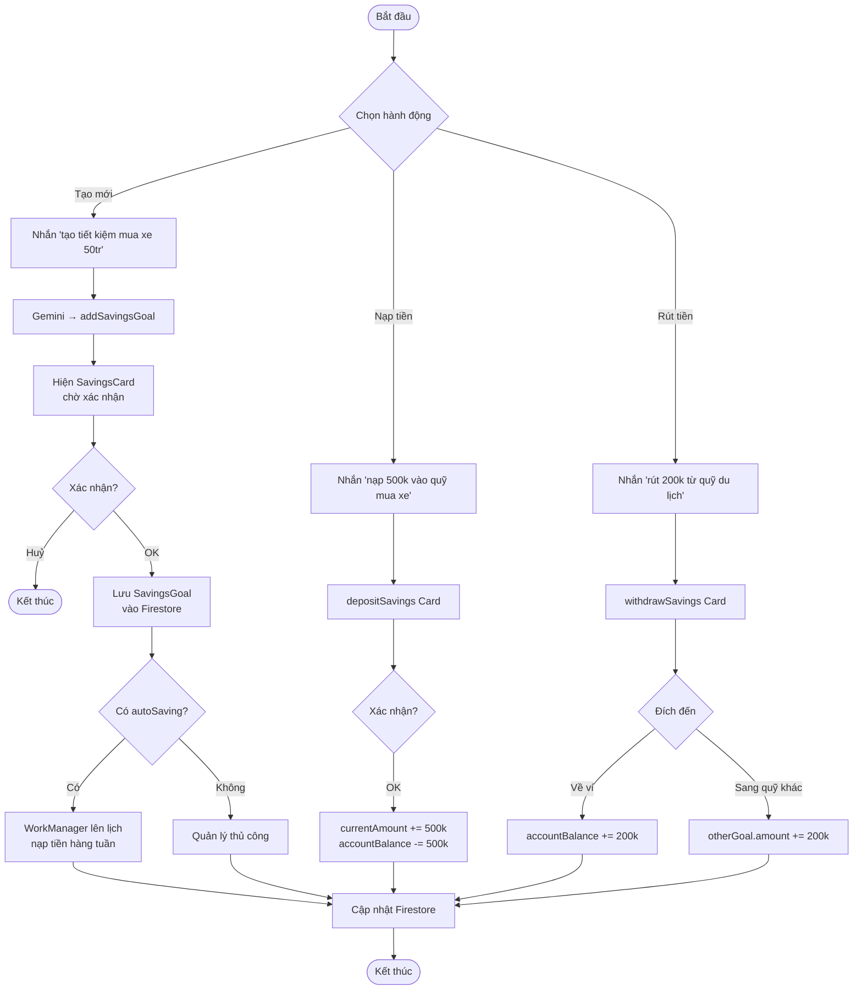

## UC04 — Sequence Diagram
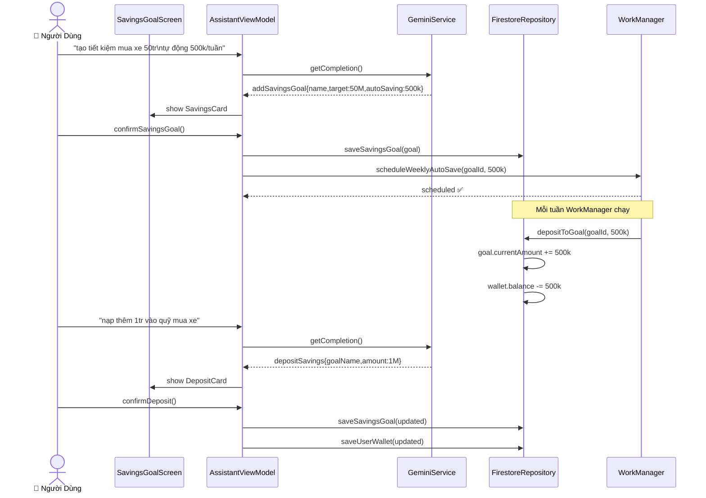

## UC04 — State Diagram
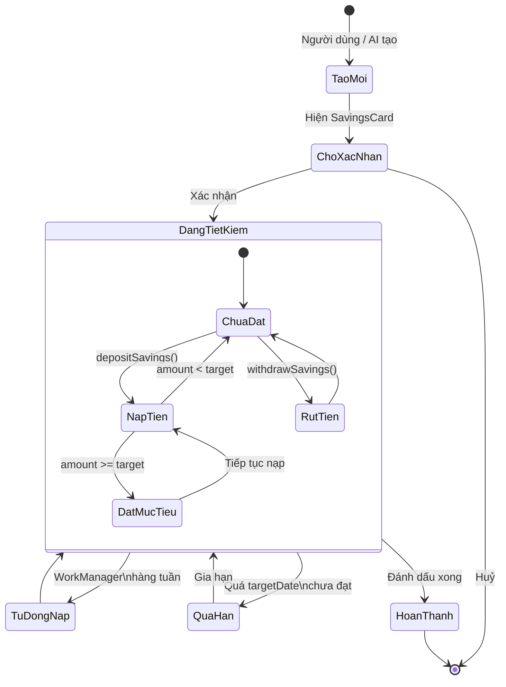

## UC04 — Communication Diagram
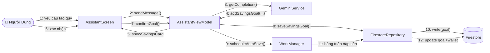

---
# UC05: Theo Dõi Sức Khỏe (Bước Chân)

## UC05 — Activity Diagram
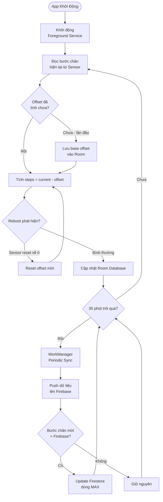

## UC05 — Sequence Diagram
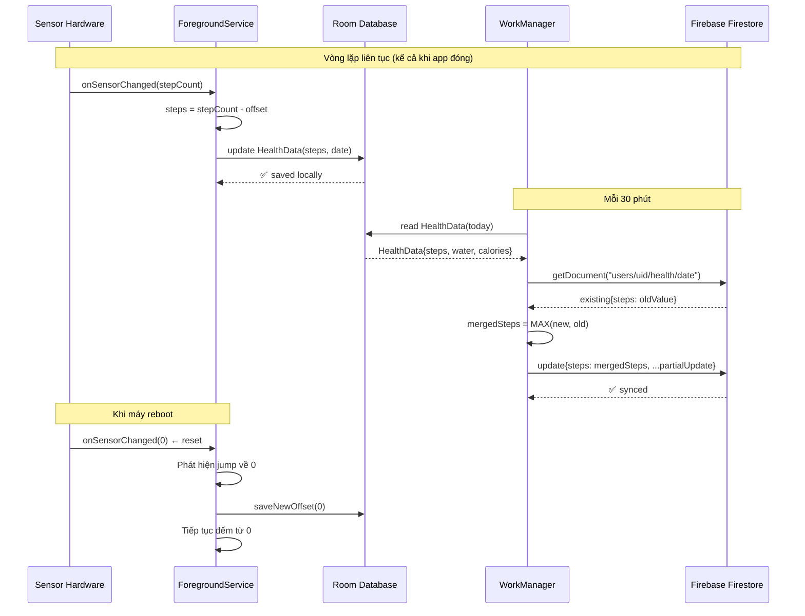

## UC05 — State Diagram
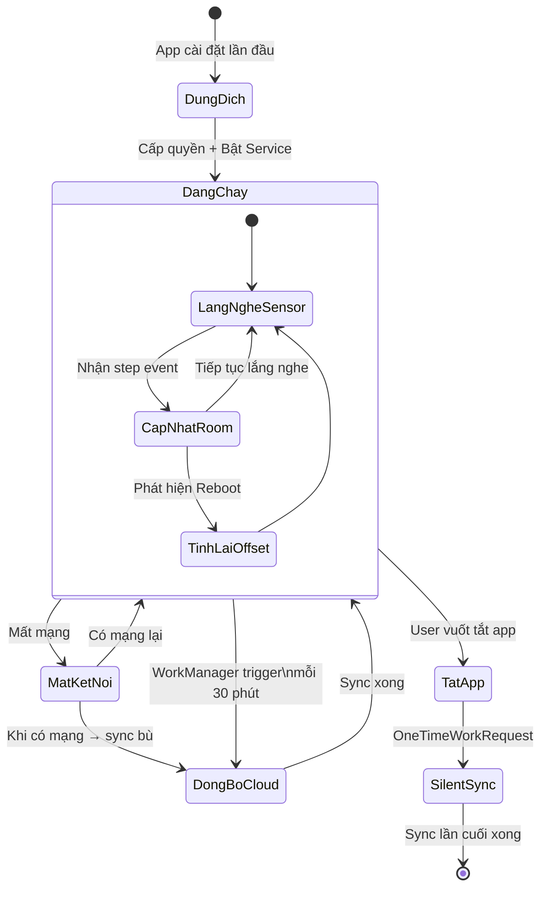

## UC05 — Communication Diagram
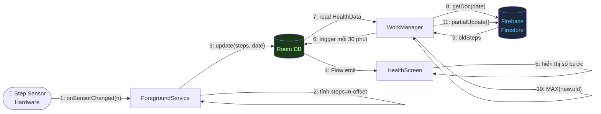

---
## 📋 Tổng Kết

| Use Case | Activity | Sequence | State | Communication |
|----------|:---:|:---:|:---:|:---:|
| UC01: Đăng ký / Đăng nhập | ✅ | ✅ | ✅ | ✅ |
| UC02: Ghi giao dịch qua AI | ✅ | ✅ | ✅ | ✅ |
| UC03: Chia bill nhóm | ✅ | ✅ | ✅ | ✅ |
| UC04: Quản lý tiết kiệm | ✅ | ✅ | ✅ | ✅ |
| UC05: Theo dõi bước chân | ✅ | ✅ | ✅ | ✅ |

**Tổng cộng: 20 biểu đồ UML**
